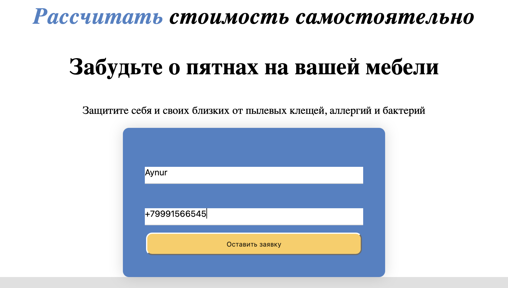
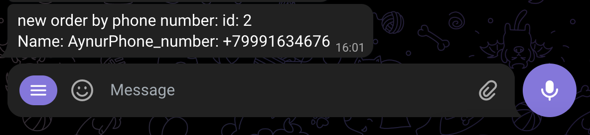

# CleaningWebSite
Web приложение на Java Spring Boot, которое позволяет пользователям оставлять заказы через веб-страницу, и удобно отслеживать их заказчику через telegram bot

## Описание

CleaningWebSite представляет собой Java Spring Boot приложение, которое позволяет пользователям оставлять заказы через веб-страницу. Заказы отправляются на почту заказчику и в телеграм-бота, где доступна статистика и возможность изменять статусы заказов. Все заказы хранятся в базе данных и связываются с приложением с использованием JPA.

## Функциональность

- Пользователи могут оставлять заказы через веб-страницу.
- Заказы отправляются на почту заказчику и в телеграм-бота.
- В телеграм-боте доступна статистика и возможность изменять статусы заказов.
- Заказы хранятся в базе данных и связываются с приложением с использованием JPA.

## Технологии

- Java Spring Boot
- JPA (Java Persistence API)
- HTML (для веб-страницы заказа)
- Почтовый клиент (для отправки заказов на почту)
- Телеграм API (для отправки заказов в телеграм-бота)
- База данных (PostgreSQL)

## Ход работы

Создание заявки на сайте

### 
Далее с помощью Dispatcher servlet принимем https запрос и обрабатываю его.
Через Java JPA обращаемся к DB и получем всех user, которым нужно отправить уведомление о заказе
Через Terlegram API отправляем telegram боту сообщение о заказе на сайте 

Через телеграм бота управляем заказом меням его статус (APPROVED, COMPLETED, FAILED) и сумму заказа

### Меню tg бота 

Так же возможно просмотреть статистику заказов за месяц

    
